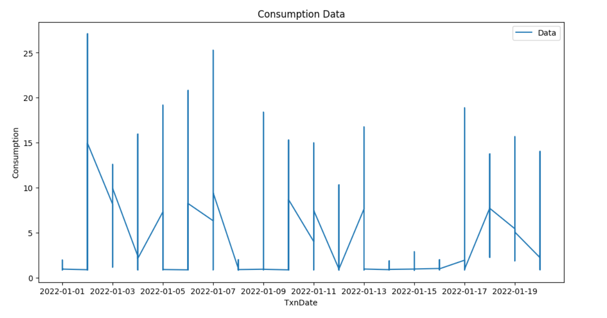
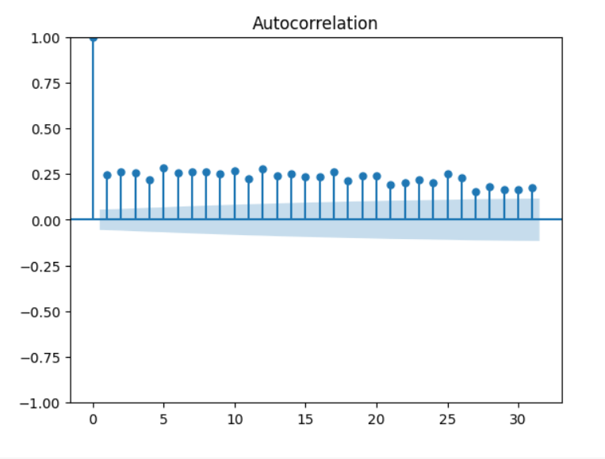
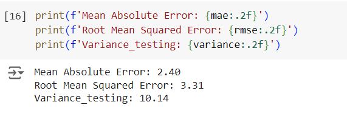

# Ex.No: 03   COMPUTE THE AUTO FUNCTION(ACF)
### Developed By: Shaik Shoaib Nawaz
### Register No: 212222240094
### Date: 

### AIM:
To Compute the AutoCorrelation Function (ACF) of the power Consumption dataset and 
to determine the model
type to fit the data.
### ALGORITHM:
1. Import the necessary packages
2. Find the mean, variance and then implement normalization for the data.
3. Implement the correlation using necessary logic and obtain the results
4. Store the results in an array
5. Represent the result in graphical representation as given below.
### PROGRAM:
```
import pandas as pd
import numpy as np
import matplotlib.pyplot as plt
from statsmodels.graphics.tsaplots import plot_acf
from statsmodels.tsa.ar_model import AutoReg
from sklearn.metrics import mean_absolute_error, mean_squared_error

# Set seed for reproducibility
np.random.seed(0)

# Load and preprocess data
data = pd.read_csv('/content/KwhConsumptionBlower78_1.csv')
data['TxnDate'] = pd.to_datetime(data['TxnDate'])
data = data.sort_values(by='TxnDate')
data.set_index('TxnDate', inplace=True)
data.dropna(inplace=True)

# Plot the consumption data
plt.figure(figsize=(12, 6))
plt.plot(data['Consumption'], label='Data')
plt.xlabel('TxnDate')
plt.ylabel('Consumption')
plt.legend()
plt.title('Consumption Data')
plt.show()

# Split into train and test data
train_size = int(0.8 * len(data))
train_data = data[:train_size]
test_data = data[train_size:]
y_train = train_data['Consumption']
y_test = test_data['Consumption']

# Compute and plot ACF for the first 35 lags
plt.figure(figsize=(12, 6))
plot_acf(data['Consumption'], lags=35)
plt.title('ACF of Consumption Data (First 35 Lags)')
plt.show()

# Fit an autoregressive model (AR)
lag_order = 1  # you can adjust based on the ACF plot
ar_model = AutoReg(y_train, lags=lag_order)
ar_results = ar_model.fit()

# Predictions
y_pred = ar_results.predict(start=len(train_data), end=len(train_data) + len(test_data) - 1, dynamic=False)

# Compute MAE and RMSE
mae = mean_absolute_error(y_test, y_pred)
rmse = np.sqrt(mean_squared_error(y_test, y_pred))
variance = np.var(y_test)

print(f'Mean Absolute Error: {mae:.2f}')
print(f'Root Mean Squared Error: {rmse:.2f}')
print(f'Variance_testing: {variance:.2f}')

# Plot actual vs predicted consumption
plt.figure(figsize=(12, 6))
plt.plot(test_data.index, y_test, label='Actual Consumption')
plt.plot(test_data.index, y_pred, label='Predicted Consumption', linestyle='--')
plt.xlabel('TxnDate')
plt.ylabel('Consumption')
plt.legend()
plt.title('Consumption Prediction with Autoregressive Model')
plt.show()

```

### OUTPUT:
#### VISUAL REPRESENTATION OF DATASET:


#### AUTO CORRELATION:


#### VALUES OF MAE,RMSE,VARIANCE:



### RESULT: 
Thus, The python code for implementing auto correlation for power consumption is successfully executed.
